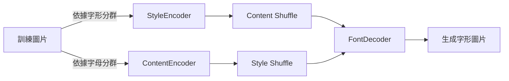

# FontGen

基於對比學習的字形生成模型，使用 ViT 作為編碼器與FiLM layers做為解碼器，實現字形風格轉換。

## 方法
### 問題描述

### 模型架構

### 訓練方法
#### 損失函數
1. pixel-wise reconstruction loss
為了確保生成的圖片能準確繪製出所需字母，pixel-wise reconstruction loss用來計算生成圖片與原始圖片之間的像素差異。
2. contrastive loss
為了使模型能夠學習到字形的風格與內容之間的區別，contrastive loss用來計算一字母或是同一字形之間的相似度。確保在經過Encoder後，同一字形的圖片在特徵空間中更接近，而不同字形的圖片則更遠離。

## 結果

### 消融實驗
#### 模型架構
1. 只使用contrastive loss，不打亂字形與內容，即與Autoencoder相同。
2. 打亂字形與內容，觀察模型是否能依據跨不同字形的特徵學習到字形的風格與內容，並使生成的字形圖片能夠保留特徵。
3. 使用GAN架構取代pixel-wise reconstruction loss

#### contrastive loss
計算相似度最常見的如CLIP中使用的cosine similarity，然而在本模型中，使用了更為簡單的L2距離來計算相似度。這是因為在實驗中發現，L2距離能夠更好地捕捉字形之間的細微差異，並且在生成字形圖片時能夠保留更多的特徵。使用cosine similarity無法有效地捕捉字形之間的差異，導致生成的字形圖片融合多種字形的特徵，無法清楚地表現出單一字形的風格。
